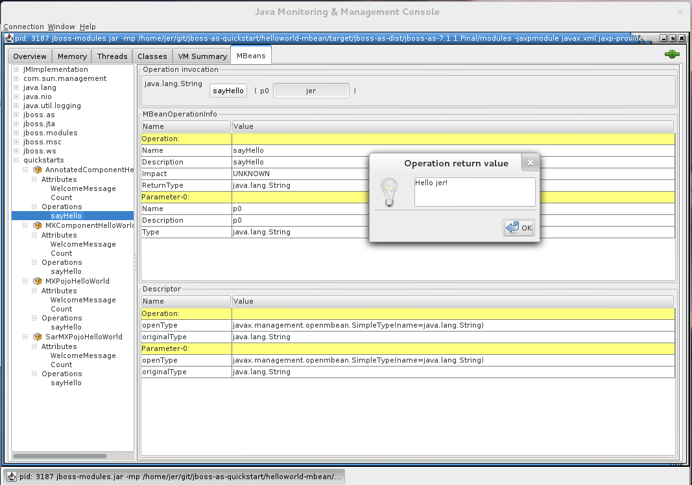

# helloworld-mbean: Helloworld Using MBean and CDI component

Author: Lagarde Jeremie  
Level: Intermediate  
Technologies: CDI, JMX, MBean  
Summary: The `helloworld-mbean` quickstart demonstrates the use of *CDI* and *MBean* in WildFly and includes JConsole instructions and Arquillian tests.  
Target Product: WildFly  
Source: <https://github.com/wildfly/quickstart/>  

## What is it?

The `helloworld-mbean` quickstart demonstrates the use of *CDI* and *MBean* in WildFly Application Server. The project also includes a set of Arquillian tests for MBeans.

The example is composed of the following MBeans:

* `AnnotatedComponentHelloWorld`: This MBean is a managed bean with `@MXBean` annotation.

* `MXComponentHelloWorld`:  This MBean is a managed bean with `MXBean` interface.

* `MXPojoHelloWorld`:  This MBean is a pojo using MXBean interface and declared in the `jboss-service.xml` file.

* `SarMXPojoHelloWorld`:  This MBean is a pojo using MXBean interface and declared in jboss-service.xml in SAR packaging.

## System Requirements

The application this project produces is designed to be run on WildFly Application Server 11 or later.

All you need to build this project is Java 8.0 (Java SDK 1.8) or later and Maven 3.3.1 or later. See [Configure Maven for WildFly 11](https://github.com/jboss-developer/jboss-developer-shared-resources/blob/master/guides/CONFIGURE_MAVEN_JBOSS_EAP7.md#configure-maven-to-build-and-deploy-the-quickstarts) to make sure you are configured correctly for testing the quickstarts.

## Use of WILDFLY_HOME

In the following instructions, replace `WILDFLY_HOME` with the actual path to your WildFly installation. The installation path is described in detail here: [Use of WILDFLY_HOME and JBOSS_HOME Variables](https://github.com/jboss-developer/jboss-developer-shared-resources/blob/master/guides/USE_OF_WILDFLY_HOME.md#use-of-eap_home-and-jboss_home-variables).

## Start the WildFly Server

1. Open a command prompt and navigate to the root of the WildFly directory.
2. The following shows the command line to start the server:

        For Linux:   WILDFLY_HOME/bin/standalone.sh
        For Windows: WILDFLY_HOME\bin\standalone.bat

## Build and Deploy the Quickstart

1. Make sure you have started the WildFly server as described above.
2. Open a command prompt and navigate to the root directory of this quickstart.
3. Type this command to build and deploy the archive:

        mvn clean install wildfly:deploy

4. This will deploy `helloworld-mbean-webapp/target/helloworld-mbean-webapp.war` and `helloworld-mbean-service/target/helloworld-mbean-service.sar` to the running instance of the server.

## Access and Test the MBeans

This quickstart differs from the other quickstarts in that it uses _JConsole_ to access and test the quickstart rather than access an URL in the browser. If you do access <http://localhost:8080/helloworld-mbean-webapp/>, you will see a screen shot image of the _JConsole_ application,

The following sections describe how to use _JConsole_ to inspect and test the MBeans.

## Start JConsole

To connect to the WildFly server using _JConsole_, open a command prompt and type the following command :

    For Linux:   JDK_HOME/bin/jconsole
    For Windows: JDK_HOME\bin\jconsole.exe

Select the local `org.jboss.modules.Main` process and click `Connect`.

A dialog displays with the warning `Secure connection failed. Retry insecurely?`. Click `Insecure` to continue.

## Test the MBeans in JConsole

You can use _JConsole_ to inspect and use the MBeans :

1. Click on the MBeans tab.
2. Expand `quickstarts` in the left column of the console.
3. Under `quickstarts`, you see the 4 MBeans: `AnnotatedComponentHelloWorld`, `MXComponentHelloWorld`, `MXPojoHelloWorld`, and `SarMXPojoHelloWorld`
4. Expand each MBean and choose: `Operations` --> `sayHello`.
5. Type your name in the (p0 String ) input text box and click the `sayHello` button.
   * For the `AnnotatedComponentHelloWorld` and `MXComponentHelloWorld` examples, you will see a popup Window displaying `Hello <your name>!`.
   * For the `MXPojoHelloWorld` and `SarMXPojoHelloWorld` examples, you will see a popup Window displaying `Welcome <your name>!`.

## Undeploy the Archive

1. Make sure you have started the WildFly server as described above.
2. Open a command prompt and navigate to the root directory of this quickstart.
3. When you are finished testing, type this command to undeploy the archive:

        mvn wildfly:undeploy

## Run the Arquillian Tests

This quickstart provides Arquillian tests. By default, these tests are configured to be skipped as Arquillian tests require the use of a container.

1. Make sure you have started the WildFly server as described above.
2. Open a command prompt and navigate to the root directory of this quickstart.
3. Type the following command to run the test goal with the following profile activated:

        mvn clean verify -Parq-remote

You can also let Arquillian manage the WildFly server by using the `arq-managed` profile. For more information about how to run the Arquillian tests, see [Run the Arquillian Tests](https://github.com/jboss-developer/jboss-developer-shared-resources/blob/master/guides/RUN_ARQUILLIAN_TESTS.md#run-the-arquillian-tests).

## Run the Quickstart in Red Hat JBoss Developer Studio or Eclipse

You can also start the server and deploy the quickstarts or run the Arquillian tests from Eclipse using JBoss tools. For general information about how to import a quickstart, add a WildFly server, and build and deploy a quickstart, see [Use JBoss Developer Studio or Eclipse to Run the Quickstarts](https://github.com/jboss-developer/jboss-developer-shared-resources/blob/master/guides/USE_JBDS.md#use-jboss-developer-studio-or-eclipse-to-run-the-quickstarts).

This quickstart consists of multiple projects and requires installation of the `JBoss Tools Maven Packaging Configurator`, so it deploys and runs differently in JBoss Developer Studio than the other quickstarts.

1. Install the JBoss Tools Maven Packaging Configurator
    * If the `Red Hat Central` page is not showing, open it by choosing `Help` --> `Red Hat Central`.
    * Click the `Software/Update` tab at the bottom of the `Red Hat Central`.
    * Scroll down to the `Maven` section, select the `JBoss Tools Maven Packaging Configurator` and click `Install/Update`.
2. Right click on the parent `helloworld-mbean` parent project and choose `Maven` --> `Update Project...`. Select all projects and click `OK`.
3. Right-click on the `helloworld-mbean-service` project and choose `Run As` --> `Run on Server`.
4. Right-click on the `helloworld-mbean-webapp` project and choose `Run As` --> `Run on Server`.
5. [Start JConsole](#start-jconsole) and [Test the MBeans in JConsole](#test-the-mbeans-in-jconsole) as described above.

## Debug the Application

If you want to debug the source code of any library in the project, run the following command to pull the source into your local repository. The IDE should then detect it.

    mvn dependency:sources
